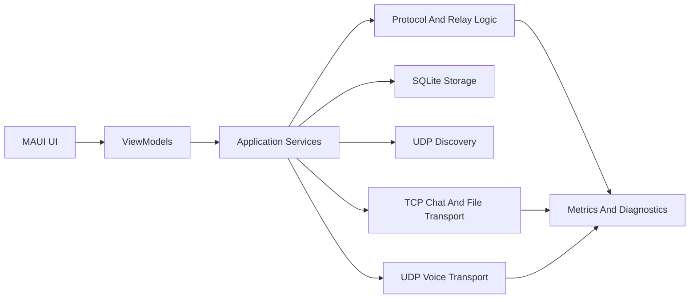
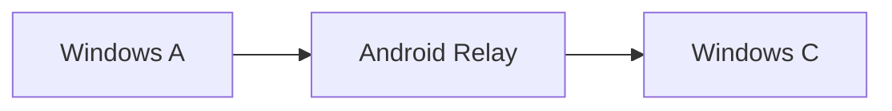

# Agent Project Context

## Purpose Of This File

Этот файл нужен как единый контекст для других чатов, устройств и агентов.

Если новый агент подключается к проекту, он должен сначала прочитать этот документ, чтобы понять:
- что за приложение строится;
- почему именно такой scope выбран;
- какие ограничения есть у команды;
- какую архитектуру нужно сохранять;
- как делится работа между людьми;
- что уже решено и что нельзя ломать.

## Project Summary

Команда строит **офлайн-децентрализованный мессенджер** для хакатона.

Цель:
- обмен сообщениями без интернета;
- работа в локальной сети / hotspot;
- передача файлов;
- relay / multihop forwarding через промежуточные устройства;
- по возможности `voice` в реальном времени;
- работа на `Windows + Android`;
- один кодбейс на `.NET MAUI C#`.

Рабочее название проекта:
- `HexTeam.Messenger`

## Main Goal

Нужно набрать **максимум баллов по ТЗ**, а не просто сделать красивый чат.

Поэтому проект должен быть:
- не самым большим;
- а самым стабильным;
- понятным для жюри;
- объяснимым архитектурно;
- воспроизводимым на демо.

## What We Are Building

Приложение должно позволять:
- обнаруживать узлы в локальной сети;
- показывать список найденных устройств;
- устанавливать P2P-сессию;
- отправлять текстовые сообщения в обе стороны;
- пересылать сообщения и файлы через relay-узел;
- передавать файл чанками с контролем целостности;
- показывать состояние соединения;
- по возможности поддерживать голосовую связь;
- собирать базовые метрики качества соединения.

## Hard Constraints

### Hardware

У команды в распоряжении:
- `1 Android` телефон;
- `2 Windows` ноутбука/ПК.

Это означает:
- можно честно показать `A -> B -> C` relay topology;
- можно показать cross-platform bonus;
- нельзя закладываться на сложный трек с большим парком телефонов;
- Bluetooth / BLE / Wi-Fi Direct нельзя считать надёжной базой демо.

### Time

На разработку есть:
- `48 часов`

Поэтому нельзя:
- строить production-grade mesh;
- делать сложное E2EE уровня Signal;
- уходить в видео;
- усложнять transport без крайней пользы.

### Competition Constraint

По ТЗ:
- нельзя брать готовое open-source решение как основу и форкать его;
- можно использовать библиотеки и фреймворки, но не готовый мессенджер как baseline.

## Score-Oriented Scope

### Main Strategy

Сначала закрыть **всю базовую часть**, потом брать дешёвые бонусы.

Лучшие бонусы по выгоде:
- `cross-platform`
- `UI/UX`
- `tests`

### Base Score Priorities

Важнее всего закрыть:
1. `peer discovery`
2. `P2P session`
3. `two-way text chat`
4. `multihop relay`
5. `network architecture explanation`
6. `Ack/retry/dedup/loop protection`
7. `file transfer protocol`
8. `security baseline`
9. `README + architecture diagram + logs/metrics`
10. `voice + measurements`, если успеваете стабильно

### Non-Goals For Early Development

Не тратить время в первые сутки на:
- video
- BLE
- Wi-Fi Direct
- NAT traversal
- group chat
- полноценный mesh routing
- production-grade E2EE

## Recommended Product Scope

### Must Have

- LAN discovery
- manual fallback connect by `IP:port`
- direct text messaging
- relay forwarding via intermediate node
- status indicators
- file transfer with progress
- file integrity verification
- chunk protocol
- reconnect behavior
- logs/metrics
- node identity
- encrypted transport for chat/file channel

### High-Value Stretch

- minimal voice call between two devices
- live latency/loss/jitter metrics
- reconnect and degraded network demo mode

### Explicit Non-Goals

- video call
- group chat
- BLE fallback
- Wi-Fi Direct fallback
- NAT traversal
- production-grade Signal-like encryption

## Why MAUI

Выбран `.NET MAUI C#`, потому что он даёт:
- `Windows + Android` из одного codebase;
- шанс взять бонус за кроссплатформенность;
- единый стек для UI;
- удобную интеграцию с `SQLite`, `Sockets`, `async/await`;
- понятный стек для команды и будущих агентов.

## Proposed Solution Structure

После создания приложения solution должно выглядеть так:

- `HexTeam.Messenger.App`
- `HexTeam.Messenger.Core`
- `HexTeam.Messenger.Tests`

### `HexTeam.Messenger.App`

Содержит:
- MAUI pages
- viewmodels
- DI registration
- navigation
- platform permissions
- platform integration for Android and Windows

### `HexTeam.Messenger.Core`

Содержит:
- domain models
- protocol models
- relay logic
- retry logic
- dedup logic
- discovery contracts
- transport abstractions
- sync logic
- file transfer logic
- voice session abstractions

### `HexTeam.Messenger.Tests`

Содержит:
- protocol tests
- relay tests
- retry tests
- reconnect tests
- file chunk tests
- dedup tests

## Architecture Direction

Нужно держать архитектуру простой и устойчивой.

Рекомендуемый стиль:
- clean-ish separation
- без enterprise-overkill
- без лишнего DDD ceremony

Базовые слои:
- `UI`
- `Application Services`
- `Protocol`
- `Transport`
- `Storage`
- `Metrics`

## High-Level Architecture

## Topology

Основная demo-topology:

Сценарии:
- `A <-> B` direct
- `B <-> C` direct
- `A -> B -> C` relay

## Transport Choices

### Discovery

Основной путь:
- `UDP broadcast` в локальной сети

Fallback:
- ручной ввод `IP:port`

### Text And File

Использовать:
- `TCP`

Причины:
- проще получить надёжность;
- проще дебажить;
- проще реализовать `Ack`, retry, resume.

### Voice

Использовать:
- `UDP`

Причины:
- меньше latency;
- проще обосновать real-time часть;
- голос важнее видео по ТЗ.

## Protocol Rules

Каждый пакет должен иметь:
- `PacketId`
- `MessageId`
- `SessionId`
- `OriginNodeId`
- `CurrentSenderNodeId`
- `TargetNodeId` или broadcast target
- `HopCount`
- `MaxHops`
- `CreatedAtUtc`
- `PacketType`

Для файлов дополнительно:
- `TransferId`
- `ChunkIndex`
- `TotalChunks`
- `ChunkHash` или итоговый `FileHash`

### Packet Types

Минимально нужны:
- `Hello`
- `PeerAnnounce`
- `SessionOpen`
- `ChatEnvelope`
- `Ack`
- `Inventory`
- `MissingRequest`
- `FileChunk`
- `FileChunkAck`
- `FileResumeRequest`
- `VoiceStart`
- `VoiceFrame`
- `VoiceStop`
- `Ping`
- `QualityReport`

## Relay Logic

Нужен не настоящий сложный mesh, а **bounded store-and-forward relay**.

Правила relay:
- forward only if packet unseen;
- forward only if `HopCount < MaxHops`;
- не отправлять назад тому peer, от которого пакет пришёл;
- хранить `seen packets`;
- поддерживать `Ack`;
- ограничивать число повторов;
- поддерживать reconnect sync.

## Reliability Rules

Обязательно реализовать:
- `Ack`
- timeout
- retry
- deduplication
- loop protection
- reconnect behavior
- локальное хранение истории

Желательно:
- bounded queue
- relay overload protection
- file throttling so file transfer does not kill chat/voice

## File Transfer Rules

Передача файлов должна быть протокольной.

Нужно:
- разбивать файл на чанки;
- отправлять чанки по очереди;
- подтверждать чанки;
- проверять целостность;
- поддерживать progress status;
- поддерживать resume;
- показывать partial delivery if interrupted.

## Security Baseline

Нужен минимум, достаточный для баллов:
- стабильный `NodeId` у каждого узла;
- видимый fingerprint / peer code при первом pairing;
- шифрование трафика;
- базовая аутентификация узлов;
- защита от спама и подмены;
- короткая threat model.

Не нужно обещать:
- сильное production-ready E2EE;
- сложную криптографию без времени на проверку.

## Metrics And Diagnostics

Приложение должно уметь показывать:
- статус соединения;
- статус relay;
- RTT;
- retry count;
- packet loss estimate;
- jitter / buffer info for voice;
- file transfer progress;
- relay queue depth if реализуемо.

### Diagnostics Screen Must Show

- `Connected / Disconnected / Relayed / Degraded`
- latency in ms
- retries
- packet loss percent
- active path or relay state

## Demo Expectations

На защите желательно показать:
1. три устройства в одной локальной сети;
2. discovery peers;
3. открытие сессии;
4. text chat в обе стороны;
5. relay `A -> B -> C`;
6. file transfer with progress;
7. integrity check success;
8. disconnect / reconnect scenario;
9. voice between two devices, если успели стабильно;
10. diagnostics and metrics.

## Team Split

Подробное распределение ролей уже вынесено в:
- `TEAM_TASK_DISTRIBUTION.md`

Коротко:
- **Person 1**: protocol, relay, retry, dedup, reconnect, tests
- **Person 2**: discovery, transport, file, voice, metrics
- **Person 3**: MAUI UI, integration, docs, demo, presentation

## Ownership Rules

Только один человек должен владеть общими integration-файлами:
- `MauiProgram.cs`
- `AppShell.xaml`
- DI registration
- общие resources/styles

Рекомендуемый owner:
- `Person 3`

## Branch Strategy

Использовать:
- `main`
- `feature/core-protocol`
- `feature/transport-file-voice`
- `feature/maui-ui-demo`

Правила:
- маленькие коммиты;
- merge каждые `3-4 часа`;
- не ломать общие DTO после freeze;
- не копить большой ночной merge.

## Freeze Decisions Before Coding

Перед большой реализацией зафиксировать:
- `Envelope` format
- packet types
- `NodeId` format
- `Ack timeout`
- `MaxHops`
- file chunk size
- hash algorithm
- connection states list
- ownership of integration files

## Skills To Use

Релевантные skills:
- `Skills/skills/brainstorming/SKILL.md`
- `Skills/skills/writing-plans/SKILL.md`
- `Skills/skills/plan-writing/SKILL.md`
- `Skills/skills/software-architecture/SKILL.md`
- `Skills/skills/dotnet-architect/SKILL.md`
- `Skills/skills/csharp-pro/SKILL.md`
- `Skills/skills/architect-review/SKILL.md`
- `Skills/skills/testing-qa/SKILL.md`
- `Skills/skills/requesting-code-review/SKILL.md`
- `Skills/skills/verification-before-completion/SKILL.md`

## Rules For Future Agents

Если другой агент продолжает работу, он должен:
- не менять архитектурное направление без причины;
- не раздувать scope;
- не предлагать видео как главный трек;
- не тащить BLE / Wi-Fi Direct в критический путь;
- сохранять relay-first thinking;
- сохранять score-driven prioritization;
- сначала закрывать base score, потом bonuses;
- не ломать frozen DTO/contracts без синхронизации;
- писать понятные docs и demo-oriented diagnostics.

## What Another Agent Should Do First

Если новый агент заходит в проект до начала кодинга:
1. Прочитать этот файл.
2. Прочитать `TEAM_TASK_DISTRIBUTION.md`.
3. Проверить, создан ли уже MAUI solution.
4. Зафиксировать proposed project structure.
5. Начать с contracts and architecture freeze.

Если новый агент заходит после начала кодинга:
1. Прочитать этот файл.
2. Найти текущий `solution` и проекты.
3. Проверить frozen DTO and protocol files.
4. Проверить branch ownership.
5. Не менять integration files без нужды.

## Definition Of Success

Проект успешен, если:
- жюри видит работающее офлайн-общение;
- relay действительно работает;
- файлы реально передаются;
- приложение объяснимо с точки зрения архитектуры;
- есть логика надёжности;
- есть базовая безопасность;
- есть документация и метрики;
- demo повторяется без хаоса.

## Current Status

На момент создания этого файла:
- ТЗ прочитано и разобрано;
- scoring strategy определена;
- hardware constraints известны;
- MAUI chosen stack already decided;
- team split already prepared;
- отдельный handoff-файл по распределению задач уже создан;
- само MAUI-приложение может ещё быть не создано или находиться в начальной фазе.

## Related Files

- `TEAM_TASK_DISTRIBUTION.md`
- `Nuclear IT Hack – ТЗ HEX.TEAM (2).docx.txt`

