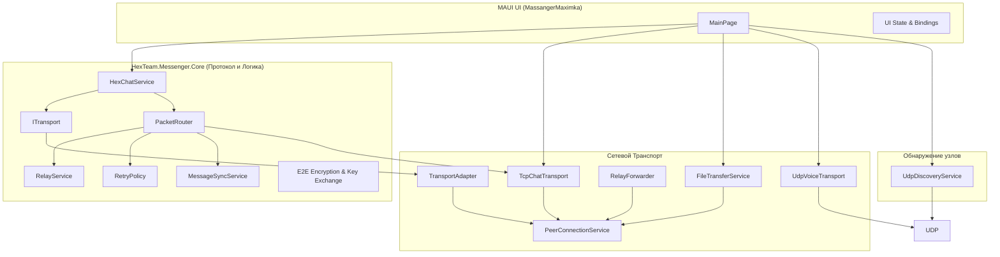

# Архитектура HexTeam Messenger

Данный документ описывает архитектуру системы децентрализованной связи, разработанной для участия в хакатоне "Nuclear IT Hack".

## Обзор архитектуры

Система построена на базе паттерна "Слоистая архитектура" (Layered Architecture) с четким разделением ответственности между UI, бизнес-логикой протокола (Core) и сетевым транспортом.

## Ключевые компоненты

### 1. UI Layer (MAUI)
Отвечает исключительно за отображение данных и взаимодействие с пользователем. Кросс-платформенная реализация (Windows, Android) из единой кодовой базы. 
В UI интегрировано отображение метрик реального времени (RTT, Packet Loss), статусов доставки (Sent, Delivered) и интерфейс управления P2P-сессиями.

### 2. Core Protocol Layer (`HexTeam.Messenger.Core`)
Сердце системы, реализующее надежную доставку сообщений поверх ненадежной децентрализованной сети.

*   `PacketRouter`: Центральный диспетчер. Принимает все входящие конверты (`Envelope`) и маршрутизирует их в нужные подсистемы (Чат, Файлы, Голос, Ack, Sync).
*   `RetryPolicy`: Отвечает за гарантию доставки. Если на отправленный пакет не пришло подтверждение (`Ack`) в течение таймаута, `RetryPolicy` повторяет отправку (до `MaxRetryCount` раз).
*   `RelayService`: Отвечает за Multi-hop (ретрансляцию). Анализирует параметр `TargetNodeId` в пакете. Если пакет предназначен другому узлу, сервис уменьшает `HopCount` и пересылает его дальше, предотвращая "зацикливание" маршрутов.
*   `MessageSyncService`: Выполняет синхронизацию пропущенных сообщений при восстановлении связи (разрывах) на основе инвентаризации истории сессии (`InventoryPacket`).

### 3. Transport Layer
Обеспечивает физическую передачу данных по сети.

*   `PeerConnectionService`: Управляет TCP-соединениями между узлами, обрабатывает подключение/отключение и сериализацию базовых пакетов.
*   `TransportAdapter`: Мост (Адаптер) между `ITransport` (ожидающим Core `Envelope`) и реальным сетевым слоем.
*   `UdpVoiceTransport`: Отдельный транспорт для передачи голоса в реальном времени. Использует UDP для минимизации задержек (RTT) и джиттера, игнорируя потери единичных фреймов в пользу скорости.
*   `FileTransferService`: Сервис передачи файлов с разбиением на чанки (Chunking) и механизмом контроля перегрузки канала (`PacketRateLimiter`), чтобы тяжелые файлы не блокировали текстовый и голосовой трафик.

### 4. Discovery Layer
*   `UdpDiscoveryService`: Реализует механизм автоматического поиска соседей в локальной сети путем периодической рассылки UDP Broadcast пакетов.

## Механизмы надежности (Выполнение ТЗ)

1.  **Дедупликация и защита от петель:**
    *   Каждый пакет имеет уникальный `PacketId` и счетчик `HopCount`. При прохождении через ретранслятор `HopCount` увеличивается. Если `HopCount > MaxHops`, пакет отбрасывается.
    *   Все ранее виденные `PacketId` сохраняются в `ISeenPacketStore`. Если узел получает пакет, который уже видел, он его игнорирует.
2.  **Гарантия доставки (Ack/Retry):**
    *   Текстовые сообщения требуют подтверждения. При отправке генерируется `MessageId`, статус становится `Sending`. При получении `Ack` статус меняется на `Delivered`.
3.  **Восстановление при разрывах:**
    *   При восстановлении P2P-сессии узлы обмениваются хэшами истории (`SessionId`). Если выявляются пропущенные сообщения, они запрашиваются повторно (Sync).
