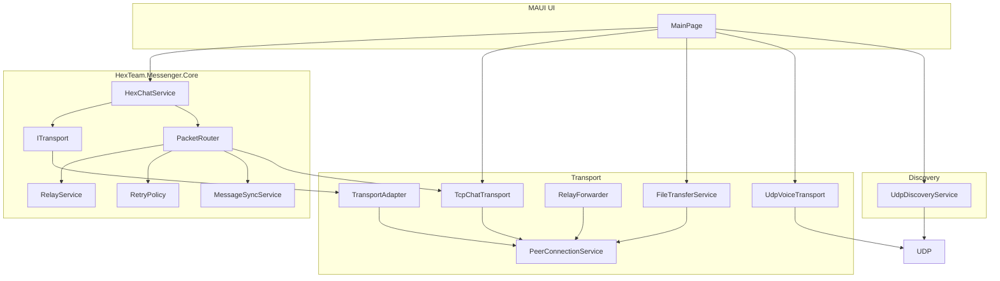

# PERSON_3 — UI и документация

**Цель:** Подключить HexChatService к MainPage, добавить архитектурную схему и обновить README.

**Граница:** `MassangerMaximka/`, `README.md`, `ARCHITECTURE.md`. Не трогать Core, Transport, PacketRouter, HexChatService.

---

## Проблема

1. MainPage использует `TcpChatTransport.SendMessageAsync` для текста — нужно перейти на `IHexChatService`.
2. В репозитории нет архитектурной схемы (требование ТЗ).
3. README не отражает новый путь чата через Core-протокол.

---

## Задача 1 — Подключить HexChatService в MainPage

**Файл:** `MassangerMaximka/MainPage.xaml.cs`

### 1.1 Добавить поле и получение сервиса

```csharp
private IHexChatService? _hexChat;
```

В `OnAppearing`:

```csharp
_hexChat = services.GetService<IHexChatService>();
```

### 1.2 Подписка на DeliveryStatusChanged

В `OnAppearing` (рядом с `_chat.DeliveryStatusChanged`):

```csharp
if (_hexChat != null)
    _hexChat.DeliveryStatusChanged += OnDeliveryStatusChanged;
```

В `OnDisappearing`:

```csharp
if (_hexChat != null)
    _hexChat.DeliveryStatusChanged -= OnDeliveryStatusChanged;
```

`OnDeliveryStatusChanged` уже есть и обновляет `_pendingItems`. Убедиться, что он вызывается и для сообщений из HexChatService (тот же формат `messageId`, `status`).

### 1.3 Отправка текста через HexChatService

В `OnSendClicked` заменить вызов `_chat.SendMessageAsync` на `_hexChat.SendMessageAsync` для обычного чата (не канал):

Было (примерно):
```csharp
var sentMsg = await _chat.SendMessageAsync(toNodeId, text);
```

Станет:
```csharp
if (_hexChat != null)
{
    var sentMsg = await _hexChat.SendMessageAsync(toNodeId, text);
    var item = AppendChat($"Me: {text}", status: "Sent");
    _pendingItems[sentMsg.MessageId] = item;
    ...
}
else
{
    var sentMsg = await _chat.SendMessageAsync(toNodeId, text);
    ...
}
```

Для канала (`_activeChannelId != null`) оставить `_chat.SendMessageAsync` — каналы пока идут по старому пути.

### 1.4 Добавить using

```csharp
using HexTeam.Messenger.Core.Abstractions;
```

---

## Задача 2 — Проверить MauiProgram / DI

**Файл:** `MassangerMaximka/MauiProgram.cs`

`AddHexMessengerCore` уже регистрирует сервисы. PERSON_1 добавит `IHexChatService` в Core.  
Убедиться, что `IHexChatService` доступен через `Services.GetService<IHexChatService>()`.  
Если интерфейс в Core, а MauiProgram ссылается на Core — ничего менять не нужно.

---

## Задача 3 — Архитектурная схема

**Файл:** `ARCHITECTURE.md` (в корне репозитория)

Создать файл `ARCHITECTURE.md` в корне. Содержимое:

```markdown
# Архитектура HexTeam Messenger

## Компоненты


```

---

## Задача 4 — Обновить README

**Файл:** `README.md`

В раздел «Возможности» или «Технологии» добавить:

- Текст чата идёт через Core-протокол (Relay, Retry, Ack, Sync).
- Дедупликация и защита от петель на уровне PacketRouter.

В раздел «Структура» добавить:

- `HexChatService` — отправка текста через ITransport/PacketRouter.

---

## Задача 5 — Smoke-тест

После мержа всех трёх веток:

1. Запустить 2 экземпляра (разные порты).
2. Подключиться, отправить сообщение.
3. Проверить статус Delivered в UI.
4. Запустить 3-й экземпляр как relay (A — B — C), отправить через B.
5. Проверить, что файлы и голос по-прежнему работают.

---

## Контракт от PERSON_1

- `IHexChatService` в DI.
- `SendMessageAsync(toNodeId, text)` возвращает `TransportChatMessage` с `MessageId` (string).
- `DeliveryStatusChanged(messageId, status)` вызывается при Ack/Failed.

---

## Контракт от PERSON_2

- Приём сообщений — через `TcpChatTransport.MessageReceived` (без изменений для UI).
- Relay-пакеты доходят до PacketRouter.

---

## Порядок выполнения

1. Задача 2 (проверка DI)
2. Задача 1 (MainPage)
3. Задача 3 (ARCHITECTURE.md)
4. Задача 4 (README)
5. Задача 5 (smoke-тест после мержа)

---

## Порядок мержа веток

1. `feature/fix-person-1-core` (HexChatService)
2. `feature/fix-person-2-transport` (TransportAdapter)
3. `feature/fix-person-3-ui-docs` (MainPage + docs)

После мержа — полный smoke-тест.
