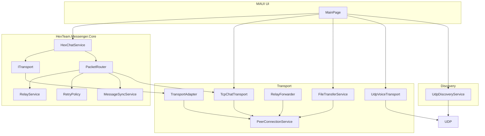

# Hex.Team — Система децентрализованной связи

[](https://dotnet.microsoft.com/)
[]()
[]()

Офлайн-децентрализованный P2P мессенджер для обмена сообщениями, файлами и голосовыми звонками без использования интернета и централизованных серверов. Приложение разработано для обеспечения связи в условиях перегрузки сети, на закрытых площадках или в аварийных ситуациях.

**Проект разработан в рамках хакатона "Nuclear IT Hack".**

## 🌟 Ключевые возможности

*   **P2P Обнаружение узлов (Peer Discovery)**: Автоматическое обнаружение устройств в локальной сети (Wi-Fi / Hotspot) через UDP broadcast.
*   **Децентрализованная маршрутизация (Multi-hop)**: Релейная передача данных через промежуточные узлы (A → B → C), если нет прямого соединения.
*   **Надежный протокол сообщений (Core Protocol)**:
    *   Подтверждение доставки сообщений (Ack).
    *   Автоматические повторные попытки отправки (Retries).
    *   Дедупликация пакетов и защита от "маршрутных петель" (HopCount & OriginNodeId).
*   **Безопасность (E2EE)**: Сквозное AES-256-GCM шифрование всего трафика, аутентификация узлов и обмен ключами по протоколу ECDH.
*   **Голосовые звонки (Real-time)**: Звонки с минимальной задержкой по протоколу UDP с адаптивной буферизацией.
*   **Передача файлов**: Передача файлов чанками с контролем целостности (SHA256), статусами и защитой от перегрузки сети (Rate Limiting).
*   **Мониторинг качества соединения**: Встроенные метрики RTT, Packet Loss, и Quality в UI.

## 🛠 Технологический стек

*   **Язык**: C# 13
*   **Фреймворк**: .NET 9, MAUI (Единая кодовая база для Windows и Android)
*   **Сетевое взаимодействие**:
    *   `TCP` — для надежной передачи сообщений и файлов.
    *   `UDP` — для Peer Discovery и потокового голоса (Real-time).
*   **Криптография**: AES-256-GCM, ECDH, SHA256.

## 📦 Предварительные требования

*   [.NET 9 SDK](https://dotnet.microsoft.com/download/dotnet/9.0)
*   Установленный workload для MAUI:
    ```bash
    dotnet workload install maui
    ```
*   (Для Android) Android SDK & Emulator.

## 🚀 Быстрый старт (Local Development)

### 1. Клонирование репозитория

```bash
git clone https://github.com/your-repo/MEPhI-HACK.git
cd MEPhI-HACK
```

### 2. Сборка проекта

```bash
dotnet build MassangerMaximka/MassangerMaximka/
```

### 3. Запуск приложения (Windows)

Для запуска первого экземпляра (Узел A):

```bash
dotnet run --project MassangerMaximka/MassangerMaximka/
```

Для тестирования на одном ПК необходимо запустить второй экземпляр на других портах (Узел B):

```bash
# Для PowerShell:
$env:HEX_TCP_PORT="45681"
dotnet run --project MassangerMaximka/MassangerMaximka/

# Для CMD:
set HEX_TCP_PORT=45681
dotnet run --project MassangerMaximka/MassangerMaximka/
```

### 4. Запуск приложения (Android)

Скомпилируйте проект под платформу Android и задеплойте на эмулятор или реальное устройство:

```bash
dotnet build MassangerMaximka/MassangerMaximka/ -t:Run -f net9.0-android
```

*Примечание: Если при сборке на Windows возникает ошибка `Permission denied` (например, проект находится в OneDrive), используйте скрипт `build-android.ps1`, который скопирует проект во временную папку и соберет APK:*

```powershell
.\build-android.ps1
```

## 🏗 Архитектура

Архитектура системы разделена на 3 основных слоя: **UI (MAUI)**, **Core (Протокол)**, и **Transport (Сетевой уровень)**.



- **HexChatService** — отправка текста через ITransport/PacketRouter.

Полное описание архитектурных решений, дедупликации пакетов и модели угроз находится в файлах:
- [`ARCHITECTURE.md`](ARCHITECTURE.md)
- [`PROTOCOL_SPEC.md`](PROTOCOL_SPEC.md)
- [`THREAT_MODEL.md`](THREAT_MODEL.md)

## 🎛 Конфигурация портов

Приложение по умолчанию использует следующие порты для работы в локальной сети:

| Назначение | Протокол | Порт по умолчанию |
| :--- | :--- | :--- |
| **Чат и Файлы (TCP)** | TCP | `45680` |
| **Peer Discovery** | UDP Broadcast | `45678` |
| **Голосовые звонки** | UDP | `45780` |

Переопределить базовый порт TCP можно через переменную окружения `HEX_TCP_PORT`.

## 🧪 Тестирование

Проект покрыт Unit-тестами, проверяющими логику Core-протокола (маршрутизацию, ретраи, Ack-статусы, криптографию).

```bash
# Запуск всех тестов
dotnet test MassangerMaximka/HexTeam.Messenger.Tests/
```

### Сценарий демонстрации (Smoke Test)

1. Подключите 3 устройства (ноутбуки/телефоны) к одной Wi-Fi сети (или раздайте hotspot с одного смартфона).
2. Откройте приложение на всех трех устройствах. В течение 5-10 секунд устройства обнаружат друг друга (слева в списке Peers).
3. **Установка P2P сессии**: Выберите узел из списка и отправьте текстовое сообщение.
4. **Надежность**: Отправьте сообщение. В UI вы увидите смену статуса с `Sending` на `Delivered` (сработает Ack).
5. **Мультихоп (A -> B -> C)**: Если Узел A не видит Узел C напрямую, но видит Узел B, Узел A может отправить пакет к C через B. Наш `RelayService` автоматически переадресует конверт.
6. **Звонки в реальном времени**: Нажмите кнопку `Start Call`. Голосовой трафик пойдет по UDP, минуя TCP-очереди, чтобы обеспечить минимальный RTT.

## 📊 Метрики и замеры

Для отслеживания качества соединения система каждую секунду отправляет `Ping` пакеты. Метрики отображаются в UI:

*   **RTT (Round-Trip Time)**: Задержка пакета в миллисекундах.
*   **LOSS**: Процент потерянных пакетов (рассчитывается на основе недошедших `Pong` ответов).
*   **QUALITY**: Оценка качества (Excellent / Good / Fair / Poor).
*   **RETRIES**: Количество пакетов, которые протокол был вынужден отправить повторно.

*Методика замеров подробно расписана в презентации к защите проекта.*
