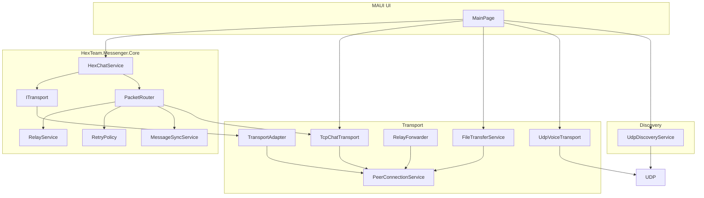

# Hex.Team — Система децентрализованной связи

[](https://dotnet.microsoft.com/)
[]()
[]()

Офлайн-децентрализованный P2P мессенджер для обмена сообщениями, файлами и голосовыми звонками без использования интернета и централизованных серверов. Приложение разработано для обеспечения связи в условиях перегрузки сети, на закрытых площадках или в аварийных ситуациях.

**Проект разработан в рамках хакатона "Nuclear IT Hack".**

## 🌟 Ключевые возможности

*   **P2P Обнаружение узлов (Peer Discovery)**: Автоматическое обнаружение устройств в локальной сети (Wi-Fi / Hotspot) через UDP broadcast.
*   **Децентрализованная маршрутизация (Multi-hop)**: Релейная передача данных через промежуточные узлы (A → B → C), если нет прямого соединения.
*   **Надежный протокол сообщений (Core Protocol)**:
    *   Подтверждение доставки сообщений (Ack).
    *   Автоматические повторные попытки отправки (Retries).
    *   Дедупликация пакетов и защита от "маршрутных петель" (HopCount & OriginNodeId).
*   **Безопасность (E2EE)**: Сквозное AES-256-GCM шифрование всего трафика, аутентификация узлов и обмен ключами по протоколу ECDH.
*   **Голосовые звонки (Real-time)**: Звонки с минимальной задержкой по протоколу UDP с адаптивной буферизацией.
*   **Передача файлов**: Передача файлов чанками с контролем целостности (SHA256), статусами и защитой от перегрузки сети (Rate Limiting).
*   **Мониторинг качества соединения**: Встроенные метрики RTT, Packet Loss, и Quality в UI.

## 🛠 Технологический стек

*   **Язык**: C# 13
*   **Фреймворк**: .NET 9, MAUI (Единая кодовая база для Windows и Android)
*   **Сетевое взаимодействие**:
    *   `TCP` — для надежной передачи сообщений и файлов.
    *   `UDP` — для Peer Discovery и потокового голоса (Real-time).
*   **Криптография**: AES-256-GCM, ECDH, SHA256.

## 📦 Предварительные требования

*   [.NET 9 SDK](https://dotnet.microsoft.com/download/dotnet/9.0)
*   Установленный workload для MAUI:
    ```bash
    dotnet workload install maui
    ```
*   (Для Android) Android SDK & Emulator.

## 🚀 Быстрый старт (Local Development)

### 1. Клонирование репозитория

```bash
git clone https://github.com/your-repo/MEPhI-HACK.git
cd MEPhI-HACK
```

### 2. Сборка проекта

```bash
dotnet build MassangerMaximka/MassangerMaximka/
```

### 3. Запуск приложения (Windows)

Для запуска первого экземпляра (Узел A):

```bash
dotnet run --project MassangerMaximka/MassangerMaximka/
```

Для тестирования на одном ПК необходимо запустить второй экземпляр на других портах (Узел B):

```bash
# Для PowerShell:
$env:HEX_TCP_PORT="45681"
dotnet run --project MassangerMaximka/MassangerMaximka/

# Для CMD:
set HEX_TCP_PORT=45681
dotnet run --project MassangerMaximka/MassangerMaximka/
```

### 4. Запуск приложения (Android)

Скомпилируйте проект под платформу Android и задеплойте на эмулятор или реальное устройство:

```bash
dotnet build MassangerMaximka/MassangerMaximka/ -t:Run -f net9.0-android
```

*Примечание: Если при сборке на Windows возникает ошибка `Permission denied` (например, проект находится в OneDrive), используйте скрипт `build-android.ps1`, который скопирует проект во временную папку и соберет APK:*

```powershell
.\build-android.ps1
```

## 🏗 Архитектура

Архитектура системы разделена на 3 основных слоя: **UI (MAUI)**, **Core (Протокол)**, и **Transport (Сетевой уровень)**.



- **HexChatService** — отправка текста через ITransport/PacketRouter.

Полное описание архитектурных решений находится в файле:
- [`ARCHITECTURE.md`](ARCHITECTURE.md)

Ниже представлены раскрывающиеся секции с техническими деталями протокола и безопасности.

<details>
<summary><b>📚 Спецификация протокола (Protocol Specification & Invariants)</b></summary>

### 1. Envelope (transport unit)
Каждый пакет в сети оборачивается в `Envelope`:
* `PacketId` (Guid) — Уникальный ID пакета.
* `MessageId` (Guid) — Логический ID сообщения (может совпадать при retry).
* `SessionId` (Guid) — Контекст сессии.
* `OriginNodeId` (Guid) — Узел, создавший пакет.
* `CurrentSenderNodeId` (Guid) — Последний узел, переславший пакет.
* `TargetNodeId` (Guid) — Целевой узел (`Guid.Empty` для broadcast).
* `HopCount` (int) — Количество пройденных узлов.
* `MaxHops` (int) — Максимальное количество прыжков (по умолчанию 5).
* `PacketType` (byte) — Тип пакета (Hello, ChatEnvelope, Ack, VoiceFrame и др.).
* `Payload` (byte[]) — Сериализованные данные.

**Инварианты маршрутизации:**
* `HopCount < MaxHops` (иначе пакет отбрасывается).
* Дубликаты отбрасываются (проверка по `PacketId`).
* Relay-узлы никогда не возвращают пакет обратно отправителю (защита от петель).

### 2. Надежность (Reliability)
* **Ack/Retry**: Пакеты `ChatEnvelope`, `FileChunk` и `FileResumeRequest` требуют подтверждения (Ack). Таймаут — 5 секунд. Максимум 3 попытки отправки.
* **Синхронизация**: При переподключении узлы обмениваются пакетами `Inventory` и `MissingRequest` для досылки потерянных сообщений.
</details>

<details>
<summary><b>🛡 Модель угроз и безопасность (Threat Model & Security Baseline)</b></summary>

Система предназначена для работы в локальных сетях (LAN/Wi-Fi Hotspot) без центрального сервера.

**Криптография:**
* **Обмен ключами**: ECDH (NIST P-256) + HKDF-SHA256.
* **Шифрование трафика**: AES-256-GCM.
* **E2EE (End-to-End Encryption)**: Шифрование содержимого сообщений (Relay-узлы не видят текст).

**Защита от угроз (STRIDE):**
* **Spoofing**: Идентификация узлов по отпечатку (SHA-256 от `NodeId`), проверка происхождения пакета.
* **Tampering**: Аутентифицированное шифрование AES-GCM защищает от модификации пакетов.
* **Information Disclosure**: Шифрование каждого TCP-соединения и дополнительное сквозное шифрование.
* **Denial of Service (DoS)**: Rate Limiting (100 пакетов / 10 сек на пира), ограничение `MaxHops = 5`, защита от маршрутных штормов.

*Примечание: в текущей версии протокола нет защиты от компрометации самого устройства и нет Certificate Authority (используются эфемерные GUID).*
</details>

## 🎛 Конфигурация портов

Приложение по умолчанию использует следующие порты для работы в локальной сети:

| Назначение | Протокол | Порт по умолчанию |
| :--- | :--- | :--- |
| **Чат и Файлы (TCP)** | TCP | `45680` |
| **Peer Discovery** | UDP Broadcast | `45678` |
| **Голосовые звонки** | UDP | `45780` |

Переопределить базовый порт TCP можно через переменную окружения `HEX_TCP_PORT`.

## 🧪 Тестирование

Проект покрыт Unit-тестами, проверяющими логику Core-протокола (маршрутизацию, ретраи, Ack-статусы, криптографию).

```bash
# Запуск всех тестов
dotnet test MassangerMaximka/HexTeam.Messenger.Tests/
```

<details>
<summary><b>🛠 Инструкции по локальному тестированию (Test Instructions)</b></summary>

Для тестирования двух экземпляров приложения на одном ПК необходимо использовать разные порты:

**Экземпляр 1 (порты по умолчанию: TCP 45680, UDP 45678/45679):**
```bash
dotnet run -f net9.0-windows10.0.19041.0 -p MassangerMaximka
```

**Экземпляр 2 (порты TCP 45681, UDP 45679/45678):**
```powershell
# Windows PowerShell
$env:HEX_TCP_PORT=45681; dotnet run -f net9.0-windows10.0.19041.0 -p MassangerMaximka
```

**Соединение:**
- Во 2-м экземпляре: введите `127.0.0.1:45680` и нажмите Connect (подключение к 1-му экземпляру).
- Либо воспользуйтесь автоматическим UDP Discovery (узлы найдут друг друга сами).
</details>

<details>
<summary><b>🎬 Сценарий демонстрации (Demo Script)</b></summary>

### Сценарий 1: Discovery + Direct Chat
1. Запустить устройство A и B.
2. Подождать 5–10 сек — B появляется в списке Peers у A (UDP discovery).
3. Отправить сообщение с A на B. На B отображается сообщение. Статус у A меняется: Sent → Delivered.

### Сценарий 2: Relay A → B → C
1. Запустить все три устройства. A подключён к B, C подключён к B (A и C напрямую не подключены).
2. С A отправить сообщение C (ввести nodeId C как получателя).
3. Сообщение уходит: A → B (relay) → C.

### Сценарий 3: File Transfer
1. На A нажать File → выбрать любой файл.
2. Наблюдать прогресс. После завершения файл сохранён в папку `HexTeamReceived` на B.

### Сценарий 4: Voice Call
1. На A выбрать B, нажать Call.
2. На B появляется баннер входящего звонка → Accept.
3. Голос идёт через UDP в реальном времени.

### Сценарий 5: Voice Messages
1. На A выбрать B, нажать REC → говорить → STOP.
2. Голосовое сообщение появляется в чате у B с кнопкой Play. Нажать Play — воспроизвести.
</details>

## 📊 Метрики и замеры

Для отслеживания качества соединения система каждую секунду отправляет `Ping` пакеты. Метрики отображаются в UI:

*   **RTT (Round-Trip Time)**: Задержка пакета в миллисекундах.
*   **LOSS**: Процент потерянных пакетов (рассчитывается на основе недошедших `Pong` ответов).
*   **QUALITY**: Оценка качества (Excellent / Good / Fair / Poor).
*   **RETRIES**: Количество пакетов, которые протокол был вынужден отправить повторно.

*Методика замеров подробно расписана в презентации к защите проекта.*
